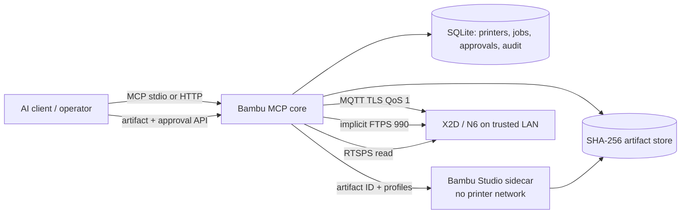

# Bambu MCP

**Safety-gated, durable 3D-print automation for Model Context Protocol clients.**

Bambu MCP turns a trusted LAN connection to a Bambu Lab printer into a typed,
auditable workflow surface for AI assistants and automation systems. It is
X2D-first, stores every model by content hash, persists every print transition,
and stops before consequential operations until a human approves the exact
immutable plan.

> **Alpha and evidence boundary:** the service is independently implemented from
> public specifications and community protocol observations. Its contract tests
> simulate X2D/N6 behavior; no physical X2D has been validated for this release.
> All X2D mutations therefore fail closed unless an operator deliberately sets
> `BAMBU_MCP_ALLOW_UNVERIFIED_X2D_WRITES=true`. FTS, chamber, airduct, and other
> catalogued-but-uncertain writes remain clearly labelled by evidence level.

## What it delivers

- MCP over stdio or Streamable HTTP, with typed tools and resources for printer
  status, AMS/FTS/HMS state, artifacts, jobs, and controls.
- A narrow HTTP API for uploads, immutable downloads, approval submission,
  health, and readiness—there is no general printer REST API.
- Content-addressed STL/3MF storage; hardened ZIP/XML validation; optional local
  imports confined to a mounted allowlist; no arbitrary host paths in MCP tools.
- A durable workflow from ingestion through inspection, slicing, validation,
  live preflight, approval, FTPS upload, MQTT start acknowledgement, and
  monitoring.
- Ten-minute, one-use approvals bound to artifact and slice hashes, printer
  model/firmware, Bambu Studio and profile versions, plate, nozzles, AMS/FTS
  mapping, and calibration options.
- MQTT QoS 1 sequencing and acknowledgement correlation, sparse-state merging,
  reconnect failure handling, implicit FTPS, pinned-CA TLS, and recursive secret
  redaction.
- An isolated, non-networked Bambu Studio 2.7.1.62 sidecar with a pre-sliced
  `.gcode.3mf` fallback when slicing or its dual-nozzle smoke test is unavailable.

## Architecture



The Python core and Bambu Studio never share a process. The sidecar can access
only the shared artifact and profile mounts plus an internal, externally
isolated network used to serve the core; only the core can reach a printer. See
[Architecture](docs/architecture.md) and the
[threat model](docs/security.md) for trust boundaries.

## Quick start

Requirements: Docker Engine with Compose 2.23.1 or newer, at least 12 GB
free for a local Studio build, and a printer on a trusted LAN with Developer
Mode enabled. Start in simulation or read-only operation before deliberately
enabling writes.

1. Create runtime directories and export secret material from a password manager
   or a secure interactive shell:

   ```bash
   mkdir -p imports profiles/{machine,process,filament}
   export BAMBU_MCP_CREDENTIAL_KEY="$(python -c 'import base64,secrets; print(base64.urlsafe_b64encode(secrets.token_bytes(32)).decode())')"
   export BAMBU_MCP_API_KEY="$(python -c 'import secrets; print(secrets.token_urlsafe(32))')"
   ```

   Compose converts these values into UID-owned, mode-0400 files under
   `/run/secrets`; they are not exposed as container environment variables. The
   credential key protects printer access codes at rest. Losing it makes stored
   credentials unrecoverable; disclosure exposes them. Store both values in a
   secret manager and export them again whenever Compose must recreate a
   container.

2. Mount full Bambu Studio machine/process/filament profile JSON files in the
   matching `profiles/` directories. Profile names in tools map to file stems.
   Official profile assets are not redistributed by this repository.

3. Build and run the loopback-bound services:

   ```bash
   docker compose build
   docker compose up -d
   curl http://127.0.0.1:8000/healthz
   curl http://127.0.0.1:8000/readyz
   ```

4. Upload a model using the narrow API:

   ```bash
   curl -H "Authorization: Bearer ${BAMBU_MCP_API_KEY}" \
     -F 'file=@model.stl' \
     http://127.0.0.1:8000/api/v1/artifacts
   ```

5. Connect an MCP client to `http://127.0.0.1:8000/mcp` with the same bearer
   token. Prepare a print, inspect its returned plan and digest, call
   `approve_print_plan`, then pass the one-use token to
   `execute_print_pipeline` before it expires.

For local MCP clients that own the process, create a stable owner-only credential
key file and use stdio:

```bash
install -d -m 700 "$PWD/data" "$PWD/artifacts"
if [ ! -s "$PWD/data/credential-key.txt" ]; then
  (umask 077; bambu-mcp keygen credential > "$PWD/data/credential-key.txt")
fi
export BAMBU_MCP_CREDENTIAL_KEY_FILE="$PWD/data/credential-key.txt"
export BAMBU_MCP_DATABASE_URL="sqlite:///$PWD/data/bambu-mcp.db"
export BAMBU_MCP_ARTIFACT_ROOT="$PWD/artifacts"
export BAMBU_MCP_BAMBU_CA_FILE="$PWD/certs/bambu-lab-ca.pem"
test -r "$BAMBU_MCP_BAMBU_CA_FILE"
bambu-mcp stdio
```

The ignored `data/credential-key.txt` must remain stable once printer credentials
are stored; back it up separately and never commit or regenerate it for an
existing database.

The CA path above assumes the command runs from this repository checkout. An
installed-wheel deployment must keep an operator-managed copy of the trusted CA
bundle and set its absolute path; certificate material is deliberately excluded
from the wheel.

See the [MCP client guide](docs/mcp-clients.md) for example configurations and
[operator guide](docs/operator-guide.md) for LAN, Developer Mode, profiles,
backups, recovery, and staged hardware validation.

## Safety model

Read-only inspection, ingestion, transformation, slicing, validation, and
preflight do not need approval. Upload/start/delete, cancellation, heating,
motion, filament movement, calibration, and experimental commands do. Approval
tokens are hashed at rest, expire after ten minutes, are consumed before the
network side effect, and cannot be replayed. Any plan change produces a new
digest and invalidates its approval.

Firmware upgrades, access-code retrieval/manipulation, cloud credentials,
MakerWorld integration, arbitrary MQTT topics, and arbitrary filesystem paths
are intentionally absent. Raw G-code and request-topic MQTT commands are both
disabled by default and remain approval-gated when explicitly enabled.

The MQTT and FTPS protocols are reverse-engineered and can change with firmware.
Keep the service on a trusted printer VLAN and retain the default loopback bind.
Read the [security guide](docs/security.md) before exposing Streamable HTTP.

## Documentation by audience

- Users and MCP integrators: [MCP client guide](docs/mcp-clients.md),
  [tool reference](docs/generated/mcp-tools.md), and
  [HTTP/OpenAPI reference](docs/generated/openapi.json)
- Printer operators: [operator guide](docs/operator-guide.md),
  [runbook](docs/runbook.md), [X2D guide](docs/x2d.md), and
  [slicing guide](docs/slicing.md)
- Security reviewers: [security model](docs/security.md),
  [protocol capability matrix](docs/protocol-capability-matrix.md), and
  [provenance ledger](docs/provenance.md)
- Contributors and maintainers: [architecture](docs/architecture.md),
  [current implementation analysis](docs/current-implementation-analysis.md),
  [contributing guide](CONTRIBUTING.md), and [testing guide](docs/testing.md)

## Development and verification

Python 3.12 is required.

```bash
python3.12 -m venv .venv
.venv/bin/pip install -e '.[dev]'
.venv/bin/ruff check .
.venv/bin/ruff format --check .
.venv/bin/mypy src
.venv/bin/pytest
.venv/bin/bandit -c pyproject.toml -r src
.venv/bin/pip-audit . --strict
.venv/bin/python -m build
```

Tests cover schema boundaries, artifact/path/archive safety, X2D mapping,
protocol sequencing and duplicate delivery, TLS construction, redaction,
approval expiry/replay, durable recovery, mocked MQTT/FTPS/slicer behavior,
HTTP and MCP contracts, and an end-to-end simulated X2D print pipeline. Hardware
tests are manual and evidence-gated. See [testing](docs/testing.md).

## Project and licensing status

This is a clean-room implementation. The earlier GPL-2.0 TypeScript fork was
used only to freeze a capability baseline; its source is not copied, translated,
or imported. Bambu Studio is an independent AGPL-3.0 program and is not included
in the Python package or core image. Sidecar build/distribution obligations and
the candidate Apache-2.0 licensing of the new core require provenance/legal
review before a public release. Until that review is recorded, [LICENSE.md](LICENSE.md)
does not grant redistribution rights.

Bambu Lab, Bambu Studio, X2D, AMS, and related names are trademarks of their
respective owners. This project is independent and is not endorsed by Bambu Lab.
