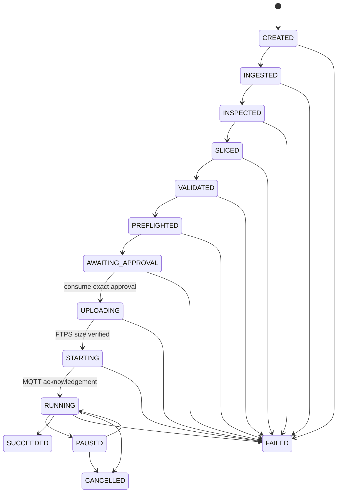

# Architecture

## Product boundary

Bambu MCP is an application service between MCP clients and LAN-mode Bambu Lab
printers. The core accepts immutable artifact IDs and typed domain inputs. It
never accepts a caller-selected MQTT topic or general host path, and the HTTP API
never mirrors printer controls.

The deployment has two processes:

1. `bambu-mcp` owns MCP, the narrow HTTP API, SQL persistence, encryption,
   artifacts, workflows, MQTT, FTPS, and RTSPS reads. It is the only service on
   the printer-facing network. Compose leaves its default PID namespace
   unshared. Camera capture still places the access code in ffmpeg argv, which
   remains visible to trusted host and Docker administrators.
2. `bambu-slicer` owns one pinned Bambu Studio CLI process at a time. It receives
   IDs and allowlisted profile names, shares artifact storage, and is attached
   only to an internal Docker network with no LAN/default route.

Bambu Studio remains an independent AGPL-3.0 program. It is not imported, linked,
or copied into the Python package or core image.

## Layers

- **Adapters:** FastMCP, FastAPI, Paho MQTT, implicit `FTP_TLS`, ffmpeg RTSPS,
  HTTP slicer client, and CLI.
- **Application:** registry, inspection, durable workflow, approval consumption,
  monitoring, queue, safe cancellation, and archival services.
- **Domain:** strict schemas, X2D/N6 capabilities, material/nozzle routing,
  transition rules, plan digest, risk/evidence catalog.
- **Infrastructure:** SQLAlchemy/Alembic, SHA-256 artifact tree, Fernet vault,
  Bambu CA bundle, and Bambu Studio sidecar.

Dependencies point inward: protocol and web adapters call the application
service; workflow code depends on gateway/slicer protocols, not Paho or
subprocess details. Contract fakes implement the same protocols.

## Durable workflow

Each arrow is a committed `job_steps` record. A restart marks ambiguous
`UPLOADING` or `STARTING` jobs failed rather than guessing whether an external
side effect occurred. `RUNNING` jobs are intentionally retained for monitoring
reconciliation. Approval tokens are committed as used before upload or command
execution, which chooses non-replay over automatic retry.

## Artifact model

The artifact ID is the lowercase SHA-256 of exact bytes. The storage path is
`<root>/<first-two-hex>/<digest>` and never includes the submitted filename.
Names are metadata-only basenames. Uploads stream to a same-filesystem temporary
file, enforce a byte ceiling, `fsync`, and atomically rename. Duplicate content
reuses a single immutable object. Core UID 10001 and slicer UID 10002 share only
supplemental artifact GID 10000; directories are setgid mode 2770 and artifact
payloads are mode 0640 so neither service needs the other service identity.

3MF archives are parsed without extraction. Entry count, total expanded size,
compression ratio, traversal, absolute paths, backslashes, NULs, and symlinks
are checked before hardened XML parsing. Sliced archives must contain plate
G-code; model archives must contain a model document.

## Plan and approval invariants

The canonical JSON plan binds both artifact hashes; job and printer identity;
model, firmware, and hardware-evidence flag; slicer and profile versions;
plate/bed/nozzles; material, AMS, secondary AMS, nozzle and FTS mappings; print
options; and output validation metadata. JSON keys are sorted and compacted
before SHA-256. Any modification changes the digest.

A token is 256 bits of URL-safe randomness. Only its SHA-256 is stored. It binds
to one digest, expires in ten minutes by default, and has one `used_at`. Guarded
actions use a separate digest over job/printer/current-state/operation/parameters.

## Extensibility

New printer models add an adapter and evidence-labelled capability ranges. New
network operations first enter the protocol matrix and risk catalog. They do not
become MCP tools until their schemas, authorization, acknowledgement behavior,
failure modes, and tests exist. Cloud APIs and opaque bridges are separate future
products, not shortcuts through this boundary.
